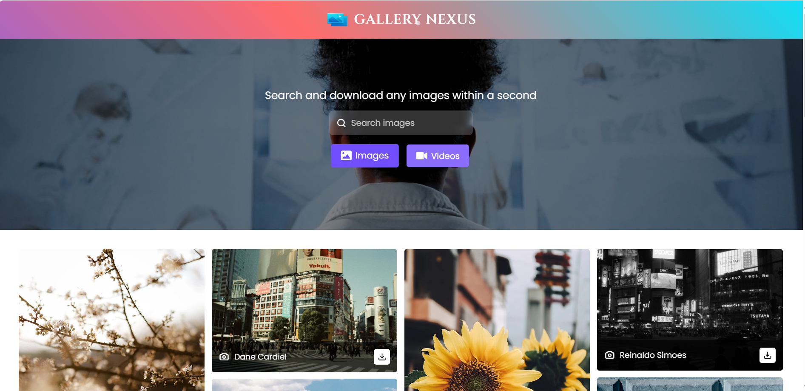

# 📸 Image Gallery

## 🌟 About the Project
Image Gallery is a premium web application that showcases **high-quality images** from various sources like **Pexels, Pixabay, and Shutterstock**. Designed with **aesthetic visuals, smooth animations, and a modern UI**, this gallery provides an elegant browsing experience.

## 🔥 Features
✅ **Dynamic Image & Video Gallery** – Browse images and videos seamlessly  
✅ **Smooth UI & Animations** – Beautiful hover effects and transitions  
✅ **Fast & Optimized** – Lazy loading for better performance  
✅ **Social Sharing** – Share images directly from the gallery  

## 🚀 Live Demo
🔗 [View Live Website](https://photonluxe.netlify.app/)


## 🎨 Screenshots  
> 📌 *Gallery Preview Below:*  



## 🛠️ Technologies Used
- HTML5 & CSS3 (Flexbox, Grid, Animations)
- JavaScript (Vanilla JS, Fetch API)
- Pexels & Pixabay API for dynamic images
- GitHub for version control

## 📥 Installation
1. **Clone the repository**  
   ```sh
   git clone https://github.com/pranith023/PhotonLuxe.git
   ```
2. **Open `index.html` in your browser**  
3. Enjoy the gallery! 🎉

## 🤝 Contributing
We welcome contributions! To contribute:  
- Fork the repository  
- Create a new branch (`git checkout -b feature-name`)  
- Commit your changes (`git commit -m "Added new feature"`)  
- Push to the branch (`git push origin feature-name`)  
- Open a Pull Request 🚀

## 📜 License
This project is licensed under the **MIT License** – feel free to use and modify!

## 📞 Contact
🔹 **Your Name** – [LinkedIn](https://www.linkedin.com/in/pranith-billa-8a9488379)  
🔹 **Email** – pranithbilla82@gmail.com

---
⭐ *If you like this project, don't forget to give it a star on GitHub!* ⭐
